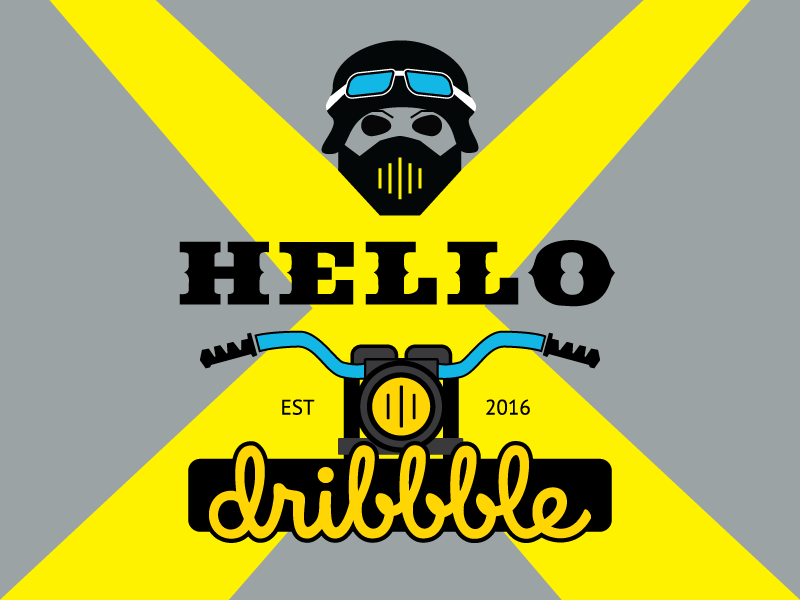

## Description:
Welcome to X Motorbike racing game, the ultimate adrenaline-pumping motorbike riding game! Get ready to experience the thrill of high-speed races, challenging obstacles, and jaw-dropping stunts as you conquer various tracks and environments.

## Features:
Exciting Tracks: Race through a variety of dynamic tracks trails to bustling city streets, each offering unique challenges and obstacles.

Thrilling Stunts: when crash take place there will be sound and motorbike will spin 30 degree.

Multiplayer Mode: Challenge your friends in intense multiplayer races and see who has what it takes to be crowned the ultimate motorbike champion.

Career Mode: Rise through the ranks in career mode, competing in a series of challenging tournaments and events to become the top rider in the world.

Easy to Learn, Hard to Master: Enjoy accessible gameplay mechanics suitable for players of all skill levels, with enough depth and challenge to keep even the most experienced riders engaged. There will be score and each time you score 5, you will get 1 more lives.

## Backlog Functionalities:
Player Movement Implementation: Allow players to control the motorbike using keyboard or gamepad inputs. This game can be played based on keyboard arrow.
1. Up Arrow: This will speed up the motorbike.
2. Down Arrow: This will backward the motorbike.
3. Left Arrow: This will move the motorbike to leftside which can be essential to avoid imminent collision.
4. Right Arrow: Similarly, this will move the Player motorbike to rightside.

Establish the framework for a single-player mode where players can race and avoid car coming from opposite direction.

The player bike will be the same and can´t be changed however in future addition feature and even player will be added as its a initial phase of developing bike race game. There will be even more obstacle added in future such as truck, bus etc.

# Technoligies Used
1.HTML 
2.CSS 
3.JavaScript 
4.DOM Manipulation 
5.JS Classes 
6.JS Audio() and JS Image() 

# States
1.Start Game Screen 
2.Game Screen 
3.Game End Screen 

## Installation

1. Clone this repository.
2. Install dependencies with `npm install`.

## Usage

To use this project, run `node index.js` in your terminal.

## Contributing

Pull requests are welcome. For major changes, please open an issue first to discuss what you would like to change.

## License